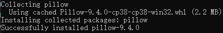

【送图书门票】Python:Excel自动化实践入门篇

正文开始之前，先给朋友们宣布个好消息，文末有送图书和门票的福利活动，不要错过哦！

---

今天周五，马上就到下午6点钟，该下班的时候了，小菜一把抓起手机刷起微信。

突然，她老板跑来小菜身后拍了拍肩膀喊：“小菜啊，我这有几份 excel 表格”，把小菜吓了一跳，立马放下手里的手机。

老板继续说，“邮件发你了，里边都是这次的出货单，明天来加会儿班弄好它，辛苦一下哈！” 说完也不等回应就转身走了

“哎” 小菜狠狠地挤出一句话，却在心里嘀咕着要怎么应付领导的吩咐，“怎么那么倒霉？又来 Excel 表，偏偏又到周末了，头疼啊……哼 ”

虽然离她坐得很远，看着小菜这么苦恼，想起自己其实是个码农，手里也有点私货，于是我走过去把自己私藏了很多年的公众号推荐给了她


---

说起办公自动化就离不开对 excel 表格的处理，现在哪个办公族不得每天面对着几份 excel 过日子？那么有没有想过，让机器帮我们自动处理这些杂活，而我们应该留给自己更多的时间去做一些更有意义的事情？

今天就带大家一起来看看怎么用 python 自动化处理 excel 表格！而处理 excel 表格的 python 功能库有很多，常用的是 openpyxl。openpyxl 库可以对 excel 表格做什么呢？比如读写、算术、绘制图表等等。

# 安装 openpyxl

openpyxl 库不是 python 的自带模块，属于第三方模块，所以需要额外安装才能使用。

在安装 openpyxl 库之前，建议先配置好 python 工程的虚拟环境 venv。这里不展开介绍如何配置虚拟环境，有需要可以点击 《[Python：界面开发，wx入门篇 上](https://mp.weixin.qq.com/s/3Yb_YAKiMte_f5HanetXiA)》前往查看。

本文以下内容基于 windows 10 和 Python3.

终端输入

```
pip install openpyxl
```

终端输出


由于下面的介绍会用到图片操作的功能，所以还需要安装 Pillow 库。

终端输入

```
pip install pillow
```

终端输出



看看最后的安装成果，终端输入

```
pip list
```

终端输出


# 创建 excel 表格文件

最简单的自动化操作就是创建一个 excel 空白表格文件，暂定文件名为 test.xlsx，然后随意写点什么进去

```
import openpyxl

workbook = openpyxl.Workbook()
sheet = workbook.active

sheet['A1'] = 'hello pytho excel !'
workbook.save(filename="./test.xlsx")
```

上面的代码先是导入了库 openpyxl，然后实例化工作簿类 Workbook，通过工作簿的属性 active 获取到活跃的工作表 sheet。

基于字典的操作方式，对工作表 sheet 的 A 列 1 行写入字符串 ‘hello pytho excel !’。如果你使用过 excel 表格，会记得 excel 表格的行是从 1 开始的，列是从 A 开始的。

最后调用工作簿的 save 方法写入硬盘，自动生成文件 test.xlsx。

好了，代码写好怎么跑起来呢？

把上面写好的代码保存到文件(.py)中，我这里随意定为 main.py，然后在令行终端里输入并回车就会执行起来

```
python main.py
```

执行完毕后，打开程序创建好的 excel 文件 test.xlsx 看看


看起来效果很好。

# 写入

上面已经知道了怎么创建新的 excel 表格文件，那么怎么在已有的 excel 表格文件的指定单元格 cell 写入内容呢？

上面介绍的方法 Workbook() 会覆盖原有文件，为了不覆盖现有文件，可以改用方法 load_workbook() 同时传入文件名以加载现有的工作簿。

指定单元格有两种方式，通过表格 sheet 的方法 cell() 或者表格 sheet 直接引用单元格名称。

比如

```
a2 = sheet.cell(row = 2, column = 1)
a3 = sheet['A3']
```

找到了单元格 cell，又怎么写入内容呢？直接赋值还是修改属性值？答案是都可以，直接赋值就是对单元格 cell 对象赋值(要求引用单元格名称)，修改属性是对单元格 cell 对象的 value 属性赋值

```
a2.value = "修改属性1"
a3.value = "修改属性2"
sheet['A4'] = "直接赋值"
```

来一段完整的代码

```
import openpyxl

workbook = openpyxl.load_workbook("./test.xlsx")
sheet = workbook.active

a2 = sheet.cell(row = 2, column = 1)
a3 = sheet['A3']

a2.value = "修改属性1"
a3.value = "修改属性2"
sheet['A4'] = "直接赋值"

workbook.save(filename="./test.xlsx")
```

看看运行效果


如果我们需要往表格里追加大量的数据呢？总不能像上面那样往单元格一个一个地写入吧？

可以使用表格 sheet 的 append() 方法一次性写入一行数据

```
import openpyxl 
  
workbook = openpyxl.load_workbook("test.xlsx")
sheet = workbook.active

data = (
    ('a', 'b', 'c'),
    ('d', 'e', 'f')
)  
for row in data:
    sheet.append(row)

workbook.save('test.xlsx')
```

看看实际效果


# 读取

上面介绍了怎么对 excel 表格写入内容，那么怎么读出来呢？

读取单元格内容，可以直接读取单元格 cell 的属性 value 值

```
print(f"{sheet['A4'].value}")
print(f"{sheet.cell(row = 4,
                    column = 1).value}")
```

那么如果需要一次性读取一个区域的数据呢？

方法有两种，一种通过遍历指定区域内每个单元格的方式，另一种是通过单元格名称批量读取。

先介绍第一种：需要遍历每个单元格的内容，那么就需要知道行列的最大数量用于控制单元格循环遍历的次数，分别对应表格 sheet 的属性 max_row 和属性 max_column。

下面来试一下把第一列和第二行的所有单元格内容读取并打印出来

```
import openpyxl

workbook = openpyxl.load_workbook("test.xlsx") 
sheet = workbook.active 
  
row = sheet.max_row
column = sheet.max_column
print(f"Total Row num: {row}")
print(f"Total Column num: {column}")

print("\nValue of first column:")
for i in range(1, row + 1):
    print(sheet.cell(row = i,
                        column = 1).value)

print("\nValue of second row")
for i in range(1, column + 1):
    print(sheet.cell(row = 2,
                        column = i).value,
            end = " ")
```

终端输出


接着介绍第二种：通过表格的单元格名称批量读取时，单元格名称分别对应矩形区域的左上角和右下角的单元格名称。这种方式类似对列表的切片操作。

下面来试一下批量读取单元格 A4 到单元格 C6 的矩形区域的内容，并打印出来

```
import openpyxl

workbook = openpyxl.load_workbook("test.xlsx") 
sheet = workbook.active 

cell_obj = sheet['A5:C6']
for cell1, cell2, cell3 in cell_obj:
    print(cell1.value,
            cell2.value,
            cell3.value)
```

终端输出


# 算术操作

在处理 excel 表格数据时，经常会用到公式来对数据执行统计。那么自动化怎么统计呢？

直接把计算公式赋值给输出结果的单元格 cell，下面试一下计算区域数据的和

```
import openpyxl

workbook = openpyxl.Workbook()
sheet = workbook.active

sheet['A1'] = 100
sheet['A2'] = 200
sheet['A3'] = 300
sheet['A4'] = 400
sheet['A5'] = 500

sheet['A7'] = '= SUM(A1:A5)'

workbook.save("sum.xlsx")
```

看看实际效果


# 调整行高和列宽

很多时候也需要对存储某些信息量的行列进行宽高调整，那么每个都要手动拖动拉伸就很令人苦恼了。这里介绍如何自动化设置行高和列宽。利用到修改单元格 cell 的属性 height 和属性 width 的值。

下面举个例子

```
import openpyxl
  
workbook = openpyxl.load_workbook("test.xlsx")
sheet = workbook.active

sheet.row_dimensions[6].height = 70
sheet.column_dimensions['C'].width = 20
  
workbook.save('test.xlsx')
```

看看实际效果


这就是简单的调整行高和列宽，会影响到同一行或列的所有单元格。

## 合并单元格

有些表格中，部分区域的单元格可以作为同一个单元格使用，那么就可以对其执行合并操作了。

合并操作通过表格 sheet 的 merge_cells() 方法实现，下面看看代码

```
import openpyxl
  
workbook = openpyxl.load_workbook("test.xlsx")
sheet = workbook.active
sheet.merge_cells("B2:C4")
  
workbook.save('test.xlsx')
```

看看实际效果


可以看到原来区域 B2:C4 中都是分离的单元格，现在合并成一个单独的单元格了。

## 拆分单元格

和合并单元格相对的，也有需要对单元格拆分的时候。拆分单元格使用的是表格 sheet 的 unmerge_cells() 方法。

再对上面的表格中被合并的单元格执行拆分处理

```
import openpyxl
  
workbook = openpyxl.load_workbook("test.xlsx")
sheet = workbook.active
sheet.unmerge_cells("B2:C4")
  
workbook.save('test.xlsx')
```

看看实际效果


现在又变回合并前的样子了

## 设置字体

同样的，表格里的有些字体也是可能需要特别设置，对于查阅内容比较有帮助。可以通过 openpyxl 的 styles 模块的 Font() 方法执行配置。

下面试一下，把单元格 A1 的内容设置为字体大小 24，粗体，italic，字体名字为 ‘Times New Roman’

```
import openpyxl
from openpyxl.styles import Font
  
workbook = openpyxl.load_workbook("test.xlsx")
sheet = workbook.active

sheet.cell(row = 1,
            column = 1).font = Font(size = 24,
                                    italic = True,
                                    bold = True,
                                    name = 'Times New Roman')
  
workbook.save('test.xlsx')
```

看看实际效果


# 绘图表

为了让 excel 表格里的内容更加便于理解，离不开数据的可视化，excel 就提供了绘制图表的功能来体现数据可视化。表格中数据和绘制的图表关联之后，数据的变更也会自动同步到图表中。

现在就介绍用到自动化的方式来绘制图表，举个栗子，现在表格里插入一列数据，然后用 Reference() 选中表格中的数据域，创建柱状图表并关联刚选中的数据域，设置表头、xy轴标签，再生成图表，最后把工作簿保存到文件 sample.xlsx。

```
import openpyxl
from openpyxl.chart import BarChart
from openpyxl.chart import Reference

workbook = openpyxl.Workbook()
sheet = workbook.active

# 插入数据到表格 sheet
for i in range(10):
	sheet.append([i])
# 选中表格的数据域
values = Reference(sheet,
                    min_col = 1,
                    min_row = 1,
                    max_col = 1,
                    max_row = 10)

# 创建柱状图表
chart = BarChart()
# 关联数据域到图表
chart.add_data(values)
# 设置图表表头
chart.title = " 实例图标 "
chart.x_axis.title = " X 轴 "
chart.y_axis.title = " Y 轴 "
# 生成图表，并贴到单元格 C2
sheet.add_chart(chart, "C2")

workbook.save("sample.xlsx")
```

看看实际效果


当然，除了可以生成柱状图，还可以生成饼状图、线状图等等，这里不展开了。


# 图片操作

有些时候也需要往 excel 表格里插入图片，那么可以使用 openpyxl.drawing.image.Image 来实现。

由于 openpyxl.drawing.image.Image 依赖于第三方模块 pillow，所以在执行调试环境里还需要安装库 pillow。前面已经安装，这里略过。

试一下把下面的图插入新建的 excel 表格里


```
import openpyxl
from openpyxl.drawing.image import Image

workbook = openpyxl.Workbook()
sheet = workbook.active

img = Image("beauty.jpg")
sheet.add_image(img, 'B2')

workbook.save("img.xlsx")
```

看看实际效果


Python+Excel 自动化实践入门篇的介绍就到此结束了，欢迎关注我的微信公众号 ENG八戒


---

# 福利来了 ！！！

这次搞了个双重福利，两份福利可同时领取。

第一重，送图书，这本书是机械工业出版社出版的《Python+Excel报表自动化实战》。

请点击 [传送门]() 参与领取


第二重，送深圳福田出海展会门票若干，门票由 Cloud Ace 倾情赞助。

请点击 [传送门]() 参与领取


【温馨提示：本活动同时在稀土掘金、博客园、微信公众号举办，互不干扰，欢迎各平台搜索博主 ENG八戒 参与最新活动】
