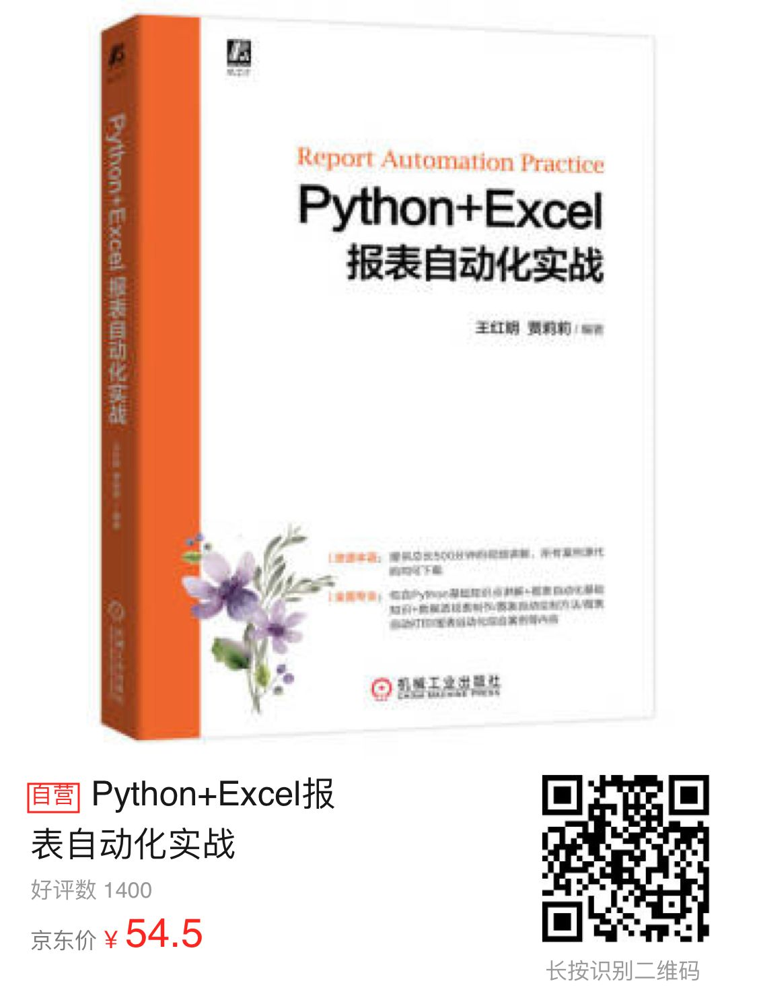

# 给大家介绍一本书《Python+Excel报表自动化实战》

大家好，我叫八戒！

为了鼓励大伙多读书，八戒 特地联合机械工业出版社搞了这期的送图书活动，图书领取规则在文末有详细说明，一定不要错过哦！

这是数字化办公的时代，也是信息爆炸的年代，现代办公内容就少不了数据可视化的操作，尤其涉及商务领域。面对汹涌而来的智能化替代潮，为了提高办公效率，势必要掌握一些自动化的工具。创业或者打工一族怎么能坐以待毙？掌握编程就是迈向新时代的敲门砖。

今天就给朋友们带来一本书《Python+Excel报表自动化实战》

下面开始介绍这本书的内容：

## 内容简介

《Python+Excel报表自动化实战》通过大量实战案例来讲解如何利用Python实现报表制作的自动化。本书主要包括Python编程基础知识、报表文件操作方法、报表工作表操作方法、报表字体格式设置方法、报表对齐方式格式设置方法、各种函数计算方法、报表数据筛选/排序/分类汇总/统计分析方法、数据透视表制作方法、图表自动绘制方法、报表自动打印方法及报表自动化综合案例等内容。 

《Python+Excel报表自动化实战》通过根据实际工作场景设计的实战案例及详细的代码解析，使读者可以轻松掌握实际工作中的报表自动化制作方法和技巧。为了方便读者学习理解，本书内容配有视频讲解，读者可以扫描对应的二维码直接观看，也可以下载学习（详细方法见本书封底）。 

《Python+Excel报表自动化实战》适合数据工作量大的职场人士、财务人士、数据分析人士等用户阅读，也可作为中、高等职业技术院校程序设计课程的参考用书。

// TODO. 购买链接
Python+Excel报表自动化实战
———————
京东价：￥54.50
抢购链接：https://u.jd.com/KzXdaLG

## 编辑推荐

资源丰富：提供总长500分钟的视频讲解，所有案例源代码均可下载 
全面专业：包含Python基础知识点讲解 +报表自动化基础知识+数据透视表制作/图表自动绘制方法/报表自动打印/报表自动化综合案例等内容

## 本书特色 

本书有如下特色：

1. 《Python+Excel报表自动化实战》通过大量实战案例来讲解报表制作自动化，实战案例全部根据实际工作场景设计。 

2. 每个实战案例都配有详细的代码解析，对每行代码的功能、代码中各个函数的含义和用法进行了详细解析，同时对于复杂的代码配有局部代码后台运行结果图，帮助读者理解代码的含义。 

3. 每个实战案例配有案例应用解析，帮助零基础读者利用案例代码解决实际工作中的问题。 

---

# 活动规则说明

1. 关注微信公众号 八呀 + 文末回复留言 获取领取图书资格（留言主题需要与本书相关）

2. 点赞数从多到少，前两名小伙伴即有机会领取图书各一本

3. 阅读量超过 500 即统计点赞数量

4. 中奖名单会在留言区公布

5. 中奖人士需要在开奖24小时内联系微信 hi_ifi 领取奖品

【温馨提示：本活动同时在稀土掘金、博客园、微信公众号举办，互不干扰，欢迎各平台搜索博主 ENG八戒 参与最新活动】
