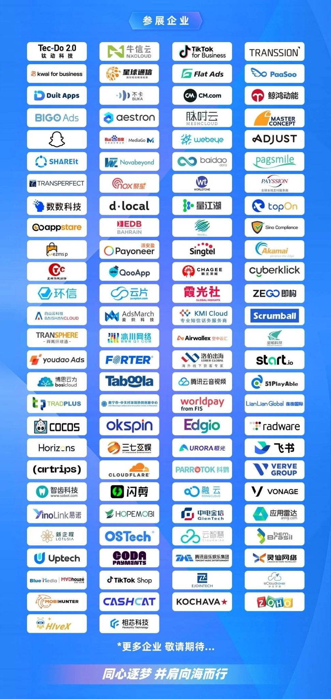

# 泛互联网行业出海交流会来了,付费门票免费送

大家好，我叫八戒！

福利领取规则在文末有详细说明，一定不要错过哦！

国内的产业经历这四十年的强劲发展，为泛互联网的迭代发展提供了非常充足的养分。原来的一片大蓝海早就变成一片红海，这些新兴的行业现而今已经不再满足于国内市场，纷纷选择出海寻找新机遇。

比如国内市场反应非常活跃的游戏、电商等，都在抓紧出海的路上。

疫情过后，百业待兴，行业交流也变得活跃了。最近恰好迎来了这次出海的交流峰会，举办的地点就在深圳福田会展中心。而深圳是国内外贸异常活跃的地区之一，相信会受到众多厂商的热烈欢迎。

下面是已经报名参会的厂商，看看是不是有想讨教的对象名列其中？

从举办方透露出来的信息来看，这次交流会的行程安排也是很饱满的，相信大概率不会让各路精英失望而返。

由于本次交流会入场需收费并且实行实名制，八戒 本着给各路朋友们送去福利的初衷，免去门票负担，联合 Cloud Ace 提供免费门票若干。免费门票领取规则在文末有详细说明，一定不要错过哦！

Cloud Ace 是谷歌云全球战略合作伙伴，拥有 300 多名工程师，也是谷歌最高级别合作伙伴，多次获得 Google Cloud 合作伙伴奖。作为谷歌托管服务商，提供谷歌云、谷歌地图、谷歌办公套件、谷歌云认证培训服务。

有关展会的更多详细信息，请前往展会举办方【白鲸出海】官方渠道获取！

---

# 活动规则说明

1. 关注微信公众号 八呀 + 文末回复留言 获取领取门票资格（留言主题需要与本次出海展会相关）

2. 点赞数从多到少，前三名小伙伴即有机会领取门票各一张

3. 阅读量超过 100 即统计点赞数量

4. 中奖名单会在留言区公布

5. 中奖人士需要在开奖24小时内联系微信 hi_ifi 领取奖品

【温馨提示：本活动同时在稀土掘金、博客园、微信公众号举办，互不干扰，欢迎各平台搜索博主 ENG八戒 参与最新活动】